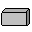
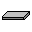
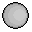
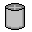
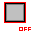
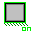

# QuickInsert08
Object insertion shortcuts for Roblox Studio 2008

## Usage
To use this tool, execute QuickInsert.lua through Tools > Execute Script.

Once ran, you will be shown a bunch of items on the bottom of Studio's screen.
Clicking on them will create the object and move it in front of where your camera is at.

Each item does the following.

| Item        | Image | Description
| ------------- |-----|:-------------:|
| Part      |       | Inserts a part
| Plate      |       | Inserts a part that's in a form of a plate.
| Ball |             | Inserts a sphere.
| Wheel |            | Inserts a cylinder
| Figure |           | Inserts a character model.
| Anchored Mode |  | Lets inserted objects become anchored or unanchored.
