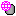
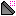
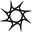
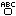

# QuickInsert08
Interface for inserting objects to Roblox Studio 2008-2010

## Usage
- Download the folder and keep it somewhere.
- Execute the 'QuickInsert.lua' script that's inside the folder through Tools > Execute Script.

Once ran, you will be shown a bunch of items on the bottom of Studio's screen.
Clicking on them will create the object and move it in front of where your camera is at.

Each item under their category do the following.

Page 1 - Basic
| Item        | Image | Description
| ------------- |-----|:-------------:|
| Part      |       | Inserts a part
| Plate      |       | Inserts a part that's in a form of a plate.
| Ball |             | Inserts a sphere.
| Wheel |            | Inserts a cylinder

Page 2 - Meshes
| Item        | Image | Description
| ------------- |-----|:-------------:|
| Head |           | Inserts a part with a head mesh.
| Wedge |           | Inserts a part that looks like a wedge.

Page 3 - Characters
| Item        | Image | Description
| ------------- |-----|:-------------:|
| Figure |           | Inserts a character model.
Note: This model is inserted from Roblox's 'content/Fonts' folder.

Page 4 - Gameplay
| Item        | Image | Description
| ------------- |-----|:-------------:|
| Neutral Spawn Location |           | Inserts a neutral spawn location.
| Team Spawn Location |           | Inserts a team spawn location. Selecting this will also let you select a team color.

Page 5 - Signs
| Item        | Image | Description
| ------------- |-----|:-------------:|
| Text Sign |           | Creates a text sign template.

All categories
| Item        | Image | Description
| ------------- |-----|:-------------:|
| Page | Page (Num) - (Category) | Flip between categories.
| Anchored Mode |  | Lets inserted objects become anchored or unanchored.
